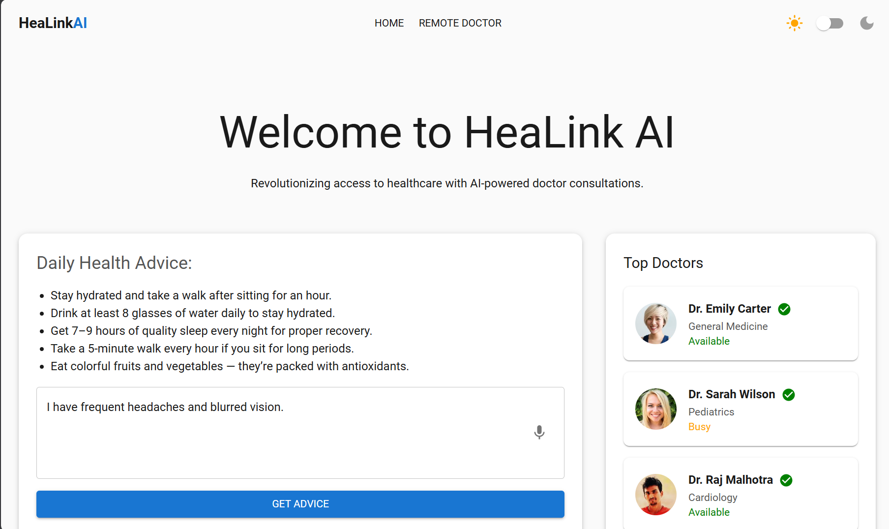
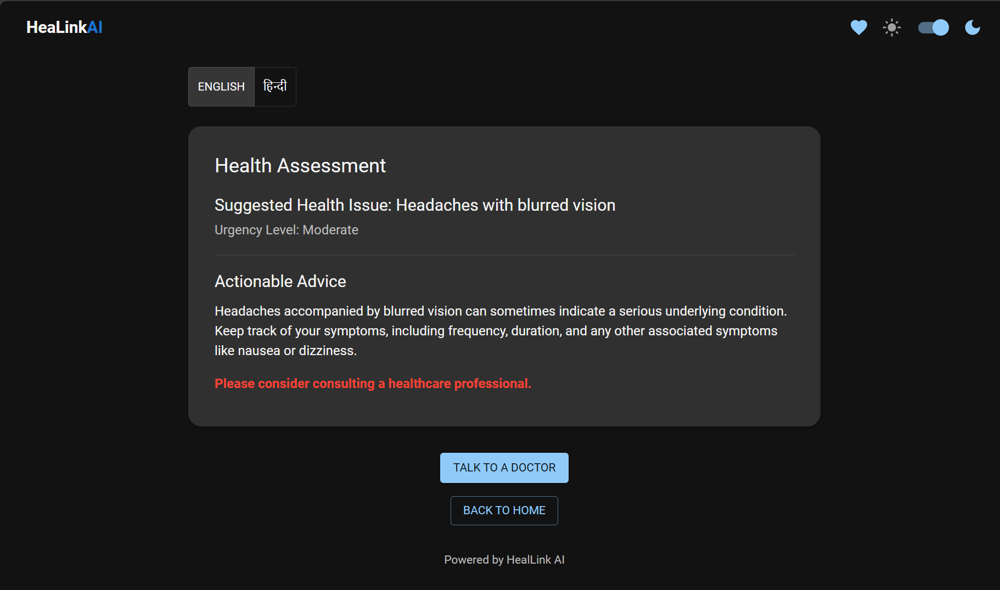
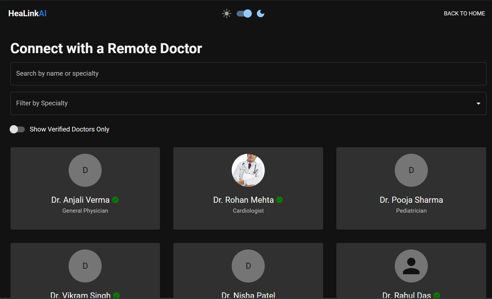
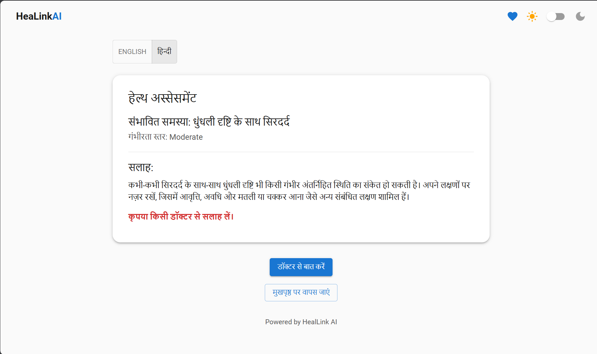
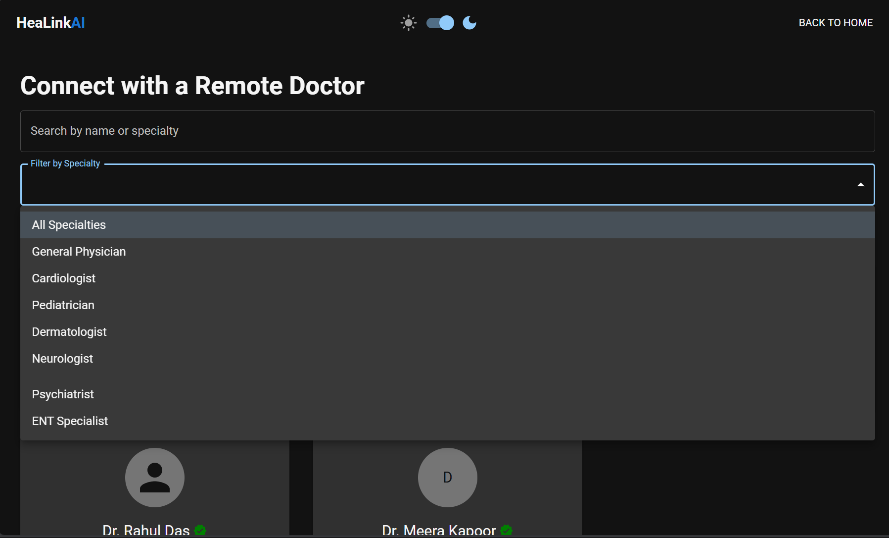

#  HealLink AI

HealLink AI is a smart healthcare assistant that provides AI-driven health advice and doctor recommendations. It supports multilingual responses (English and Hindi), theme toggling (light/dark), and a clean animated UI. Built with React, MUI, Framer Motion, and Gemini AI.

## 🚀 Features

- 🔍 Ask health-related questions and get AI-generated assessments
- 🌐 Translate responses to Hindi
- 🌓 Toggle between dark and light themes
- 📱 Responsive and mobile-friendly UI
- 📅 Navigate to Doctor Booking (placeholder)
- 🏠 Go back to Home or navigate to Health Tips from anywhere

## 🛠️ Tech Stack

- React (Vite)
- Material UI (MUI)
- Framer Motion
- React Router
- Google Gemini API (for AI health advice)
- Google Cloud Translation API (for Hindi translation)

## 📂 Project Structure
```
src/
├── App.jsx
├── main.jsx
├── components/
│   └── AIResponse.jsx
├── pages/
│   ├── Home.jsx
│   ├── DoctorPage.jsx
│   └── Tips.jsx
├── utils/
│   ├── gemini.js
│   └── translate.js
└── assets/
```

## 🔧 Getting Started

### 1. Clone the Repository

```bash
git clone https://github.com/your-username/healink-ai.git
cd healink-ai
```

### 2. Install Dependencies

```bash
npm install
```

### 3. Add Your API Keys

Create a `.env` file and add:

```
VITE_GEMINI_API_KEY=your_gemini_api_key
VITE_GOOGLE_TRANSLATE_API_KEY=your_google_translate_api_key
```

### 4. Run the App

```bash
npm run dev
```

##  Screenshots






##  Inspiration

Built for a GDG hackathon to help underserved communities get fast, AI-driven health insights in multiple languages.

## 📬 Feedback

Pull requests and feedback are welcome!


Made with ❤️ by Ayush Yadav
